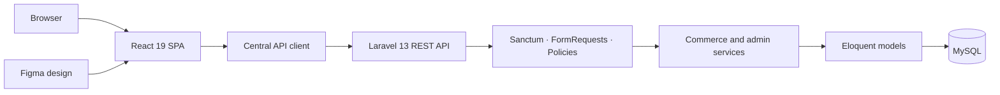
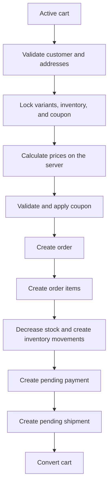
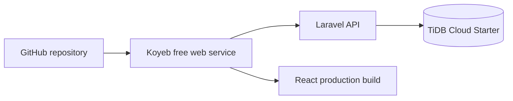

# Seef E-commerce

Full-stack e-commerce application built with Laravel 13, React 19, MySQL, and Laravel Sanctum.

Seef E-commerce is an API-first portfolio project demonstrating REST API design, SPA authentication, catalogue administration, guest carts, transactional checkout, inventory control, orders, coupons, reviews, security, and a responsive React interface.


## Live Demo

Deployment in progress.

- Storefront: deployment in progress
- Admin demo: deployment in progress
- API health endpoint: deployment in progress
- [Figma design](https://www.figma.com/make/Ws3iRp8Gy7gfcv0BQiKxOs/Ecommerce-store-design-model?t=ICyVwlBLiHwf3BQ3-20&fullscreen=1)
- [Public Figma site](https://ide-mural-42346251.figma.site/)

## Project Overview

Seef E-commerce is a full-stack, API-first commerce application designed to demonstrate an architecture closer to a real application than a basic CRUD exercise.

- **Frontend:** React single-page application with protected routes and a central API client.
- **Backend:** Laravel REST API organized around requests, resources, policies, services, and Eloquent models.
- **Authentication:** stateful Laravel Sanctum authentication for the React SPA.
- **Database:** MySQL-compatible relational schema with products, variants, stock, carts, orders, and supporting commerce entities.
- **Design:** responsive light/dark interface derived from the official Figma concept.

The application keeps business rules on the server. Prices, discounts, stock availability, ownership, and checkout totals are never trusted from the browser.

## Features

### Storefront

- Public catalogue with pagination, search, categories, sorting, and featured products
- Product pages with images, variants, prices, promotions, and inventory availability
- Responsive landing page based on the Seef visual identity
- Persistent light and dark themes
- Accessible desktop header and animated mobile navigation drawer
- Loading, empty, validation, and network-error states

### Customer

- Account registration, login, logout, current-user session, and password reset flow
- Guest cart stored through a secure cookie
- Authenticated cart and guest-cart merge after login
- Private wishlist
- Shipping and billing address management
- Private order list and order details
- Reviews restricted to eligible completed purchases

### Commerce

- Server-side price and total calculation
- Product variants and inventory availability
- Percentage and fixed coupons with date, amount, global, and per-user limits
- Transactional checkout
- Inventory locking and stock movements
- Order items, status history, pending payment, and initial shipment record
- Cart conversion after a successful order transaction

### Administration

- Dashboard metrics, recent orders, revenue trend, and low-stock count
- Product and category API management
- Variant, option, option-value, and product-image API management
- Customer and order administration
- Coupon and inventory administration
- Review moderation

The current React administration interface exposes the dashboard. The complete administration CRUD is available through the API and remains on the frontend roadmap.

### Security

- Sanctum SPA authentication with session cookies
- CSRF protection and credential-aware CORS
- Rate limiting on authentication, catalogue, cart, and checkout operations
- Active-account and administrator middleware
- FormRequest validation
- Policies and ownership checks
- API Resources preventing accidental model exposure
- Database transactions and pessimistic inventory locks
- Server-side prices, discounts, totals, and stock validation

## Architecture



The React client sends JSON requests with credentials. Laravel validates and authorizes requests before delegating multi-step operations to transactional services. Eloquent models represent the relational commerce domain.

## Tech Stack

| Layer | Technology | Purpose |
|---|---|---|
| Frontend | React 19 | SPA pages, state, and reusable UI components |
| Routing | React Router 7 | Public and protected client routes |
| Build tooling | Vite 8 | Development server and production build |
| Styling | Modern CSS | Design tokens, responsive layouts, themes, and motion |
| Backend | Laravel 13 | REST API and application architecture |
| Language | PHP 8.3+ | Backend runtime |
| Authentication | Laravel Sanctum 4 | Stateful SPA authentication and CSRF |
| Persistence | MySQL | Relational commerce data |
| ORM | Eloquent | Models, relationships, scopes, and transactions |
| Backend testing | PHPUnit 12 | Feature and unit tests |
| Code quality | Laravel Pint, ESLint | PHP and JavaScript quality checks |

## Project Structure

```text
Seef_E_commerce/
├── backend/
│   ├── app/
│   │   ├── Http/
│   │   │   ├── Controllers/Api/
│   │   │   ├── Requests/
│   │   │   └── Resources/
│   │   ├── Models/
│   │   ├── Policies/
│   │   └── Services/
│   ├── database/
│   │   ├── factories/
│   │   ├── migrations/
│   │   └── seeders/
│   ├── routes/
│   └── tests/
├── frontend/
│   ├── src/
│   │   ├── app/
│   │   ├── assets/
│   │   ├── components/
│   │   ├── hooks/
│   │   ├── pages/
│   │   └── services/
│   └── public/
└── docs/
```

Generated dependencies (`vendor`, `node_modules`), local environment files, logs, build output, test caches, and local AI-tool configuration are excluded from Git.

## Checkout Flow



Checkout runs inside a database transaction with retries. Inventory rows are locked before stock is checked and decremented, reducing overselling risks under concurrent requests.

Real payment processing is **not enabled** in the portfolio demo. Payment records remain pending and no card, cash-on-delivery, or bank-transfer option should be interpreted as a banking integration.

## API

The current application exposes 77 Laravel routes, including 76 routes under `/api`.

Representative endpoints:

| Method | Endpoint | Access |
|---|---|---|
| `GET` | `/api/products` | Public |
| `GET` | `/api/products/{slug}` | Public |
| `GET` | `/api/categories` | Public |
| `GET` | `/api/cart` | Guest or customer |
| `POST` | `/api/cart/items` | Guest or customer |
| `POST` | `/api/checkout` | Guest or customer |
| `GET` | `/api/orders` | Customer |
| `GET` | `/api/admin/dashboard` | Administrator |
| `GET` | `/api/admin/products` | Administrator |
| `PATCH` | `/api/admin/inventory/{inventory}` | Administrator |

Full API reference: [docs/API.md](docs/API.md)

## Demo Data

`php artisan migrate --seed` creates:

- 12 catalogue products across clothing, shoes, accessories, and new arrivals
- Size and shoe-size variants
- Regular, low-stock, and out-of-stock variants
- Standard and discounted products
- Coupon `BIENVENUE10` for 10% off orders of at least 100 MAD
- One customer and one administrator account

Seeded product images currently use external Unsplash URLs with `disk = external`. The public storefront reads those URLs correctly, but no `external` Laravel filesystem disk is configured. Consequently, the admin image resource requires a compatibility fix before a complete seeded-image administration demo.

## Demo Accounts

> Demo accounts only. These credentials are generated locally by the database seeder and must never be reused for a real account.

| Role | Email | Password |
|---|---|---|
| Customer | `client@seef.test` | `password` |
| Administrator | `admin@seef.test` | `password` |

## Local Installation

### Requirements

- PHP 8.3+
- Composer
- Node.js and npm
- MySQL-compatible database

The local ports are deliberately separated from common Docker development ports:

- Laravel API: `http://localhost:8017`
- React SPA: `http://localhost:5187`

### Backend

```powershell
cd backend
composer install
Copy-Item .env.example .env
php artisan key:generate
php artisan migrate --seed
php artisan storage:link
php artisan serve --host=localhost --port=8017
```

Configure the MySQL connection in `backend/.env` before running migrations.

### Frontend

```powershell
cd frontend
npm install
Copy-Item .env.example .env
npm run dev
```

Open `http://localhost:5187`.

### Environment Variables

Only variable names and safe examples belong in version control:

| Application | Variables |
|---|---|
| Laravel | `APP_URL`, `DB_CONNECTION`, `DB_HOST`, `DB_PORT`, `DB_DATABASE`, `DB_USERNAME`, `DB_PASSWORD` |
| SPA security | `FRONTEND_URL`, `SANCTUM_STATEFUL_DOMAINS`, `SESSION_DOMAIN` |
| React | `VITE_API_URL` |

Never commit `.env` files or real credentials.

## Testing & Quality

Run the backend checks:

```powershell
cd backend
php artisan test --compact
vendor\bin\pint --test
php artisan route:list --except-vendor
```

Run the frontend checks:

```powershell
cd frontend
npm run lint
npm run build
```

Validation performed before publication:

| Check | Result |
|---|---|
| Laravel routes | 77 total / 76 API routes |
| PHPUnit | 200 tests / 974 assertions passing |
| Laravel Pint | Passing |
| ESLint | Passing |
| Vite production build | Passing |

## UI/UX & Figma

The React interface uses a design system derived from the official Seef Figma work: typography, layout hierarchy, catalogue cards, responsive breakpoints, and the updated logo-inspired colour palette.

- [Official Figma project](https://www.figma.com/make/Ws3iRp8Gy7gfcv0BQiKxOs/Ecommerce-store-design-model?t=ICyVwlBLiHwf3BQ3-20&fullscreen=1)
- [Public Figma site](https://ide-mural-42346251.figma.site/)
- [Figma implementation notes](docs/FIGMA.md)

The frontend includes a persistent light/dark theme, keyboard-visible focus states, reduced-motion support, responsive product grids, and a mobile navigation drawer.

## Screenshots

Final screenshots will be added after deployment. Recommended captures:

- Homepage
- Catalogue
- Product details
- Cart and checkout
- Customer orders
- Admin dashboard

No placeholder image is referenced, so the README remains clean until real screenshots are available.

## Deployment

The planned portfolio architecture is:



Koyeb's free service is intended for portfolio demonstration only. Local uploads are not persistent on a free instance without a volume; external seeded images remain suitable for the catalogue demo.

Detailed deployment guide: [docs/DEPLOYMENT_DEMO.md](docs/DEPLOYMENT_DEMO.md)

## Roadmap

- Integrate a real payment gateway with signed, idempotent webhooks
- Complete returns and refunds
- Add advanced shipment and delivery management
- Build the complete React administration CRUD
- Add automated frontend component and end-to-end tests
- Perform a complete accessibility audit
- Resolve the seeded external-image disk compatibility issue
- Deploy the public portfolio demo

## Documentation

- [API reference](docs/API.md)
- [Architecture](docs/ARCHITECTURE.md)
- [Security](docs/SECURITY.md)
- [Figma mapping](docs/FIGMA.md)
- [Demo deployment guide](docs/DEPLOYMENT_DEMO.md)
- [Final technical report](docs/RAPPORT_FINAL_SEEF_ECOMMERCE.md)

## What This Project Demonstrates

- REST API design and Laravel service architecture
- Relational modelling with Eloquent
- React SPA development and API integration
- Authentication, authorization, validation, and secure resource exposure
- Transaction handling and concurrency protection
- Inventory, coupon, cart, checkout, and order workflows
- Responsive UI design, accessibility foundations, testing, and technical documentation

## Author

**Youssef BOUGHIOUL**  
Full Stack Web Developer  
Technicien Spécialisé en Développement Digital — Option Web Full Stack

GitHub: [github.com/5eef](https://github.com/5eef)
