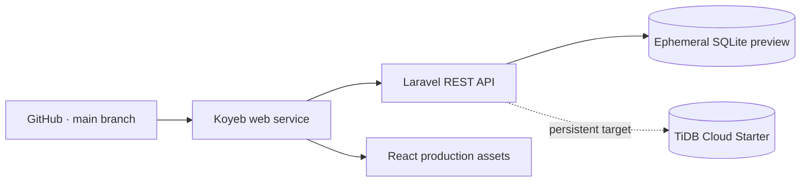

# Demo Deployment Guide

This guide covers an immediately usable free preview and the persistent portfolio target. Only put a public URL in the README after its health, catalogue, and authentication smoke tests pass.

## Target Architecture



The repository is a monorepo with `backend/` and `frontend/`. Koyeb supports selecting a work directory for monorepos. The included root `Dockerfile` implements the single-service option:

1. Node builds the React SPA with the same-origin API base `/api`;
2. Composer installs production PHP dependencies;
3. Apache serves the React assets and forwards Laravel/API requests;
4. the entrypoint migrates the database and optionally loads demo seed data.

This approach uses a single free Koyeb Web Service. The alternative is to deploy Laravel from `backend/` and host React as a separate static service.

## 1. Choose the Database Mode

### Immediate free preview

The container can start without an external database. Configure these variables for a zero-cost first deployment:

```dotenv
DB_CONNECTION=sqlite
DB_DATABASE=/var/www/html/database/database.sqlite
CACHE_STORE=database
SESSION_DRIVER=database
QUEUE_CONNECTION=sync
SEED_DEMO_DATA=true
```

The entrypoint creates the SQLite file, runs migrations, and loads the idempotent demo seeders. This makes the catalogue and both demo accounts usable immediately. Koyeb free-instance storage is ephemeral, so catalogue or account changes made through the demo can be lost after a restart or rescheduling; the seed data is recreated at the next start.

### Persistent TiDB Cloud target

1. Create a TiDB Cloud Starter instance.
2. Create a dedicated database for Seef.
3. Generate a database password and store it in a password manager.
4. Open the instance connection dialog and copy the public host, port, username, and database name.
5. Configure a TLS connection. TiDB Cloud Starter requires TLS for standard public connections.

Laravel already maps `MYSQL_ATTR_SSL_CA` to PDO's MySQL TLS option in `backend/config/database.php`.

Typical Koyeb database variables:

```dotenv
DB_CONNECTION=mysql
DB_HOST=<tidb-host>
DB_PORT=4000
DB_DATABASE=<database>
DB_USERNAME=<username-with-instance-prefix>
DB_PASSWORD=<secret>
MYSQL_ATTR_SSL_CA=/etc/ssl/certs/ca-certificates.crt
```

Use the actual CA bundle path available in the selected runtime image. Do not copy database credentials into GitHub or the repository.

Official references:

- [Create a TiDB Cloud Starter instance](https://docs.pingcap.com/tidbcloud/create-tidb-cluster-serverless/?plan=starter)
- [Connect to TiDB Cloud Starter](https://docs.pingcap.com/tidbcloud/connect-to-tidb-cluster-serverless/?plan=starter)
- [TLS connections for Starter](https://docs.pingcap.com/tidbcloud/secure-connections-to-serverless-clusters/)

## 2. Prepare the Koyeb Service

1. Connect Koyeb to the GitHub account `5eef`.
2. Select the `5eef/Seef_E_commerce` repository and the `main` branch.
3. Choose a Git-driven deployment with the root `Dockerfile` builder.
4. Select a free Web Service only for the portfolio demo.
5. Keep the repository root as the work directory and expose HTTP port `8000`.
6. Disable automatic production deployment until the first staging build is validated.

Official references:

- [Deploy from GitHub](https://www.koyeb.com/docs/build-and-deploy/deploy-with-git)
- [Koyeb monorepo work directories](https://www.koyeb.com/docs/build-and-deploy/monorepo)
- [Deploy a PHP application](https://www.koyeb.com/docs/deploy/php)

## 3. Configure Laravel

Set secrets and environment-specific values in the Koyeb service configuration:

```dotenv
APP_NAME="Seef E-commerce"
APP_ENV=production
APP_KEY=<generated-production-key>
APP_DEBUG=false
APP_URL=https://<public-domain>

FRONTEND_URL=https://<storefront-domain>
SANCTUM_STATEFUL_DOMAINS=<storefront-domain>
SESSION_SECURE_COOKIE=true

LOG_CHANNEL=stderr
CACHE_STORE=database
SESSION_DRIVER=database
QUEUE_CONNECTION=sync
FILESYSTEM_DISK=local
SEED_DEMO_DATA=true
```

Generate `APP_KEY` locally without publishing it:

```powershell
php artisan key:generate --show
```

For the immediate preview, add the SQLite variables from section 1. For a persistent deployment, add the TiDB variables as Koyeb secrets instead.

## 4. Configure React

The production build requires the public Laravel API URL:

```dotenv
VITE_API_URL=https://<api-domain>/api
```

Run the frontend quality checks before packaging:

```powershell
cd frontend
npm ci
npm run lint
npm run build
```

`VITE_*` values are embedded at build time. Changing `VITE_API_URL` requires a new frontend build.

## 5. Release Commands

Run database migrations as a controlled release command:

```powershell
php artisan migrate --force
php artisan optimize
```

Seed demo data only in the portfolio environment:

```powershell
php artisan db:seed --force
```

Do not run `migrate:fresh` against a shared or production database.

## 6. Smoke Tests

After deployment, verify:

- `GET /up` returns a successful health response.
- `GET /api/products` returns the seeded catalogue.
- the storefront can request `/sanctum/csrf-cookie`.
- customer and administrator demo accounts can sign in.
- guest cart, cart merge, wishlist, and address ownership work.
- checkout creates a pending payment and decreases stock once.
- customer and administrator routes reject unauthorized access.
- CORS accepts only the exact storefront origin.
- `APP_DEBUG` is disabled.

## Storage Limitation

Koyeb free instances use ephemeral local storage and cannot attach a persistent volume. The preview SQLite database and product uploads stored on the local `public` disk can disappear after a restart or rescheduling. The idempotent seeders restore the public catalogue and demo accounts, while external seeded images remain available. Use TiDB and object storage when persistence is required.

See [Koyeb instance limitations](https://www.koyeb.com/docs/reference/instances) and [Koyeb volume limitations](https://www.koyeb.com/docs/reference/volumes).

## Known Pre-deployment Work

- Configure object storage for persistent uploads.
- Add a real payment gateway only with signed, idempotent webhooks.
- Add production monitoring, backups, and an explicit rollback procedure.
