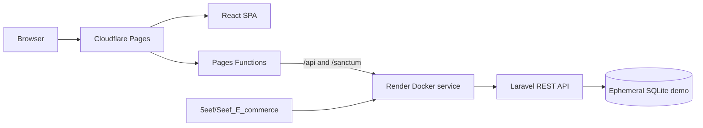

# Demo Deployment Guide

The public demo is deployed with Cloudflare Pages for the React frontend and Render for the Laravel backend.

- Storefront: <https://seef-ecommerce-5eef.pages.dev/>
- Render API: <https://seef-ecommerce-api-5eef.onrender.com/>
- Render healthcheck: <https://seef-ecommerce-api-5eef.onrender.com/up>

## Architecture



The Pages Functions proxy keeps browser requests on the storefront origin. This avoids cross-site cookie problems for Laravel Sanctum: `/api/*` and `/sanctum/*` are forwarded server-side to Render, while the SPA uses the relative API base `/api`.

## Render Backend

The root `Dockerfile` builds the React assets and Laravel application. `render.yaml` defines the free Docker web service, healthcheck, port, SQLite preview, session settings, and demo seeding.

Required production values include:

```dotenv
APP_ENV=production
APP_DEBUG=false
APP_URL=https://seef-ecommerce-api-5eef.onrender.com
FRONTEND_URL=https://seef-ecommerce-5eef.pages.dev
SANCTUM_STATEFUL_DOMAINS=seef-ecommerce-5eef.pages.dev
SESSION_SECURE_COOKIE=true
SESSION_SAME_SITE=lax
DB_CONNECTION=sqlite
DB_DATABASE=/var/www/html/database/database.sqlite
CACHE_STORE=database
SESSION_DRIVER=database
QUEUE_CONNECTION=sync
SEED_DEMO_DATA=true
PORT=8000
```

`APP_KEY` is configured only in Render and must never be committed. The entrypoint runs production migrations and the idempotent demo seeder when the container starts.

Official references:

- [Render Docker deployments](https://render.com/docs/docker)
- [Render web services](https://render.com/docs/web-services)
- [Render Blueprint specification](https://render.com/docs/blueprint-spec)

## Cloudflare Frontend

The Cloudflare Pages project is `seef-ecommerce-5eef`. Build and deploy it from `frontend/`:

```powershell
npm ci
npm run lint
npm run build
npx wrangler pages deploy dist --project-name seef-ecommerce-5eef --branch main
```

Set this Pages production variable before deployment:

```dotenv
BACKEND_URL=https://seef-ecommerce-api-5eef.onrender.com
```

The proxy implementation lives in `frontend/functions/`. The SPA fallback is handled by Pages, so client routes such as `/shop`, `/cart`, and `/admin` load `index.html` directly.

Official references:

- [Deploy a React site to Cloudflare Pages](https://developers.cloudflare.com/pages/framework-guides/deploy-a-react-site/)
- [Pages Functions routing](https://developers.cloudflare.com/pages/functions/routing/)
- [Pages Functions bindings](https://developers.cloudflare.com/pages/functions/bindings/)
- [Serving Pages and SPA fallback](https://developers.cloudflare.com/pages/configuration/serving-pages/)

## Verified Smoke Tests

The public deployment was checked after release:

- storefront: HTTP 200;
- Render `/up`: HTTP 200;
- proxied `/api/products`: HTTP 200 with 12 seeded products;
- `/sanctum/csrf-cookie`: HTTP 204;
- customer login and authenticated `/api/auth/me`: HTTP 200;
- administrator login and `/api/admin/dashboard`: HTTP 200.

Demo credentials are documented in the root README.

## Free-tier Limitations

The Render free web service can spin down after inactivity, so the first request may take longer. Its filesystem is ephemeral: SQLite changes and locally uploaded files can disappear after a restart or spin-down. The seeders recreate the catalogue and demo accounts, but this deployment must not be treated as persistent production storage.

See [Render free service limitations](https://render.com/docs/free). For persistent use, replace SQLite with a managed database and store uploads in object storage.

## Future Releases

Render redeploys from the public GitHub repository. Cloudflare Pages is currently a Wrangler Direct Upload project, so publish new frontend builds with the command above. Before every release, run the backend tests, ESLint, the Vite build, and the public authentication smoke tests.
